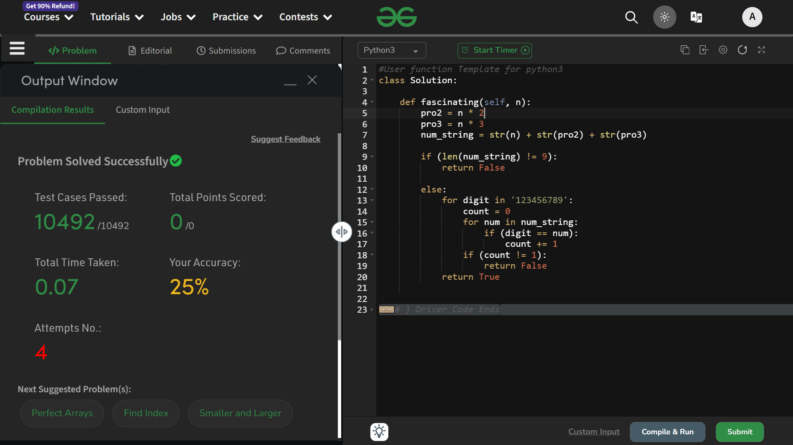

# Fascinating Number

## Question Statement ~
Given a number N. Your task is to check whether it is fascinating or not.

Fascinating Number: When a number(should contain 3 digits or more) is multiplied by 2 and 3, and when both these products are concatenated with the original number, then it results in all digits from 1 to 9 present exactly once.

## Explaination 

Lets' understand the question first, then we'll move to the solution.
- We are given a number, lets' suppose it `192`
- We have to multiple it by `2`
```python
192 * 2 == 384
```
- Next, multiple it by `3`
```python
192 * 3 == 576
```
- Now concatenate them, don't add! Concatenate!!
```python
'192' + '384' + '576' == '192384576'
```
- Now the condition is that we have to check if this number contains digits ranging from `1 - 9` , exactly 1 time each. Meaning, the frequency of each digit, inside the number obtained `192384576` should be exactly one and the number should have all the digits from `1 - 9` .

I hope the question is clear

Now that the question is clear, lets' move to its solution.
- we have created two individual variables to store the *twice* and *thrice* of the *main number*
```python
pro2 = n * 2
pro3 = n * 3
```

- Now we are creating a string out of these three individual number, which are - **n**, **twice of n** and **thrice of n**. And for this purpose, we are using explicit type-casting feature in python.
```python
num_string = str(n) + str(pro2) + str(pro3)
```
- Now from the question, it is very clear that the output number (formed from n, 2n and 3n), should have exactly nine digits, in order to satisfy the condition. So, why not to check it before stepping into the process ? If found something else than 9, `return False` !
```python
if (len(num_string) != 9):
    return False
```

- Now, if the output number has exactly 9 digits, follow this `else` block. Through this else block, we are iterating thorugh every number inside the output number and matching the occurences of individual digits from *'123456789'* with them, if any digit has more than one occurence in the number, `return False` else `return True` .
```python
else:
    for digit in '123456789':
        count = 0
        for num in num_string:
            if (digit == num):
                count += 1
        if (count != 1):
            return False
    return True
```

Thats' it....

## Performance Status : Accepted

## Time Complexity
*Expected* : O(1)

*In real* : O(1)

## Space Complexity
*Expected* : O(1)

*In real* : O(1)


## Solution


# Thank You