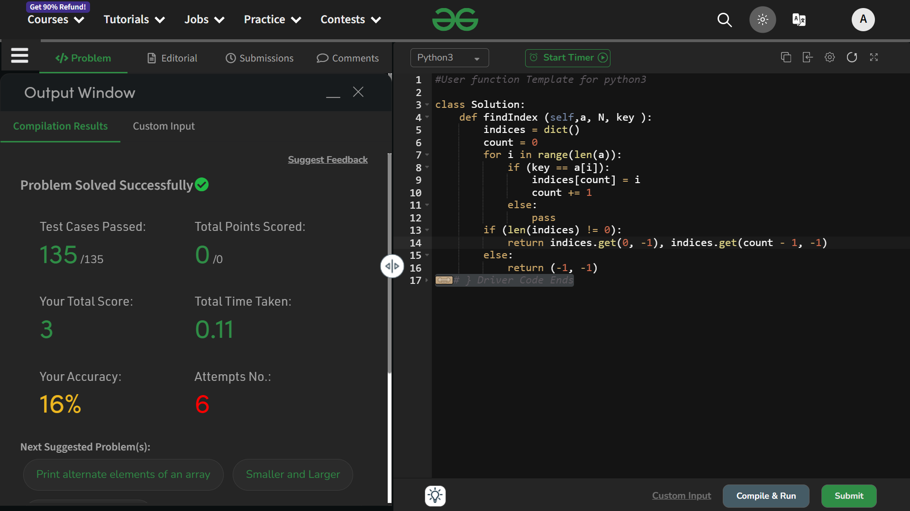

# Find Index

## Question
- Given an unsorted array Arr[] of N integers and a Key which is present in this array. 
- You need to write a program to find the start index( index where the element is first found from left in the array ) and end index( index where the element is first found from right in the array ).
- If the key does not exist in the array then return -1 for both start and end index in this case.

## Explaination
- first I have created a dictionary to store all the instances of the key found in the array. The structure of the dictionary is as follows ~
```python
indices = dict()
# indices = {<instance no.> : <index-at-which-the-key-is-found>}
```

- Next I have created a `count` variable to store the count of the total occurences found in the array.
```python
count = 0
```

- Next we are iterating through the array `a` and finding all the occurences matching with the value inside `key` . 
 - If the value inside the array at ***i<sup>th</sup>*** position matches with the key, a *key:value* value pair will be added in the dictionary.
 - If the value doesn't matched, *pass* .
```python
for i in range(len(a)):
   if (key == a[i]):
       indices[count] = i
       count += 1
   else:
       pass
```

- Next we are writing the `return` statements, I mean, what to return at which condition.
```python
if (len(indices) != 0):
    return indices.get(0, -1), indices.get(count - 1, -1)
else:
    return (-1, -1)
```
- Here we are returning a tuple of 2 values, which are basically the 1st and last key:value pairs in the dictionary. And if there is no occurence found, then return a tuple of two ***-1s*** .

### Time Complexity : O(n)
### Space Complexity : O(n)

## Solution : Accepted


# Thank You