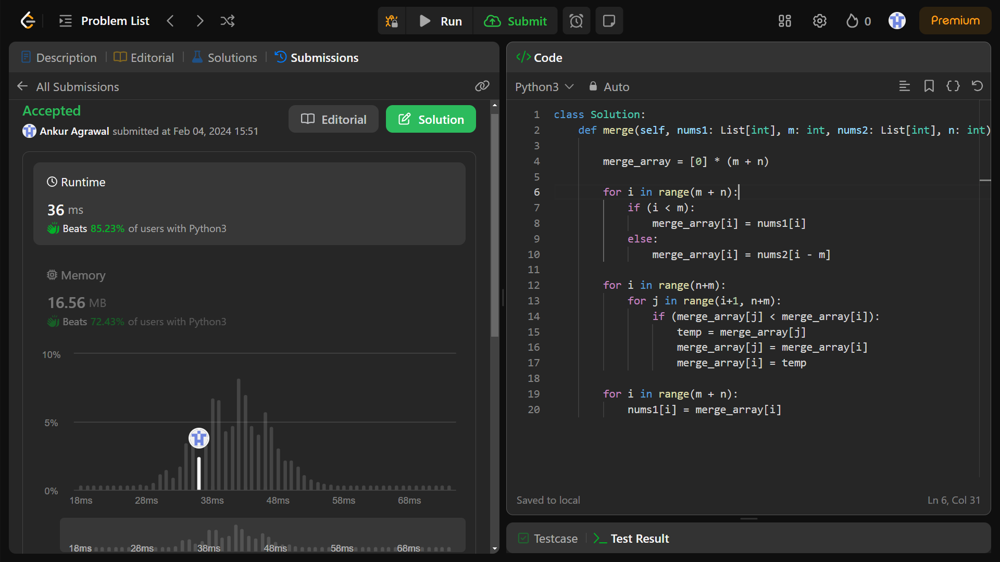

# Merge Sorted Array

## Question ~ 
- You are given two integer arrays `nums1` and `nums2` , sorted in *non-decreasing order*, and two integers `m` and `n` , representing the *number of elements* in nums1 and nums2 respectively.

- Merge nums1 and nums2 into a single array sorted in *non-decreasing order*.

- The final sorted array should not be returned by the function, but instead be stored inside the array `nums1`. To accommodate this, nums1 has a length of `m + n`, where the first m elements denote the elements that should be merged, and the last n elements are set to 0 and should be ignored. nums2 has a length of n.

## Understanding The Question
- We are given two arrays 
```python
# Size (m + n)
nums1 = []

# Size (n)
nums1 = []
```

- Both the arrays are in non-decreasing order ? This means that either the adjacent elements are equal or the succeeding element is greater than the preceding element. Example ~
```python
nums1 = [1, 2, 2, 3]
# Here in this array, either all the elements are arranged in increasing order
# or the two elements are equal!
```

- There is a thrid array, in which these two arrays have to get merged. Lets' call it `merge_array` .
```python
merge_array = [elements from nums1 + elements from nums2]
```

- This `merge_array` should also be sorted in *non-decreasing order*.

- The `merge_array` should not be returned by the function, instead, this array should be merged inside the `nums1` array. Thats' why the `nums1` array has been assigned a length of `(m + n)` elements, so that it can hold them.

Now the question is pretty much clear, lets' move to the solution

## Solution
- first we have created a `merge_array` of size `(m + n)` and assigned all its elements as `zero` .
```python
merge_array = [0] * (m + n)
```

- Next we are getting the elements from the two arrays `nums1` and `nums2` and merging them in this newly formed array.
```python
for i in range(m + n):
    if (i < m):
        merge_array[i] = nums1[i]
    else:
        merge_array[i] = nums2[i - m]
```

- Now we are sorting this `merge_array` array in ascending order. Why ? Because ascending order ensures that the elements are not in decreasing order, simple !
```python
for i in range(n+m):
    for j in range(i+1, n+m):
        if (merge_array[j] < merge_array[i]):
            temp = merge_array[j]
            merge_array[j] = merge_array[i]
            merge_array[i] = temp
```

- Now copy this `merge_array` elements, sorted in non-decreasing order to `nums1` , as per the question.
```python
for i in range(m + n):
    nums1[i] = merge_array[i]
```

Thats' it ......

# Performance Status : Accepted



# Time Complexity ~
Expected ~ (No mention, but a follow up to bring it to O(m+n))

In Real ~ O((m+n)^2)

# Space Complexity ~
Expected ~ (No mention)

In Real ~ O(m+n)


# Thank You