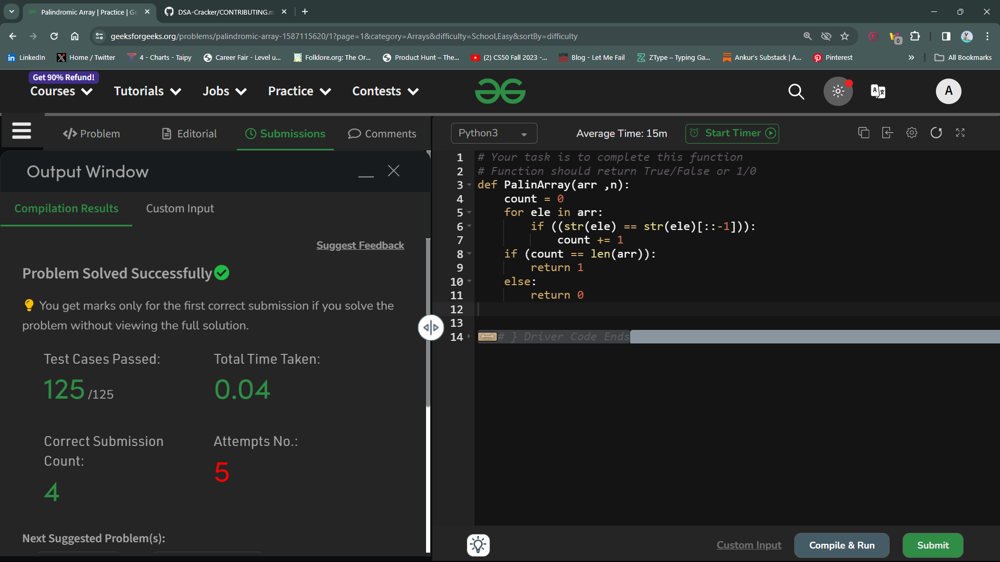

# Palindromic Array

## Question 
Given a Integer array A[] of n elements. Your task is to complete the function PalinArray. Which will return 1 if all the elements of the Array are palindrome otherwise it will return 0.

## Approach 
In Python, we have *type-casting*, and *string slices* functionalities. And I have made use of these two functionalities to drive to the solution.

- In the first step, we have initialised a count variable to 0, inside our function `PalinArray()`. This variable will count exactly how many values inside the array are palindromic. 
```python
count = 0
```

- In the second step, we have created a *for loop*, which will iterate through the array of elements. In the body of *for loop*, we are checking if the string equivalent of the element is equal to the reverse of it. 
We know that a element is said to be palindromic, **_if and only if_** it is same from both the sides, or the reverse state of it is equal to its normal state.
And if the string equivalent of that string is found to be following the condition, then the count value will be increased by one.
```python
for ele in arr:
    if ((str(ele) == str(ele)[::-1])):
        count += 1
```

- In the third step, we are out of loop now and now we'll check if the value inside the count variable is equal to the length of the array or not!
Basically, we know that if all the elements are palindromic, then the value inside the `count` variable should be equal to the length of the array. If so, `return 1` , otherwise `return 0`.
```python
if (count == len(arr)):
    return 1
else:
    return 0
```

## Performace Status : *Solved*

## Solution Screenshot



# Thank You