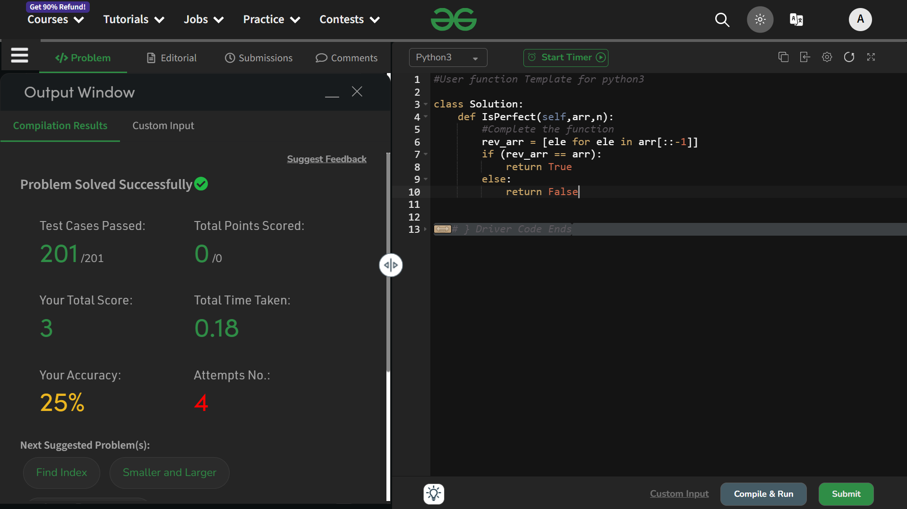

# Perfect Arrays

## Question 
Given an array of size N and you have to tell whether the array is perfect or not. An array is said to be perfect if its reverse array matches the original array. If the array is perfect then return True else return False.

## Explaination
- first, we are using list comprehension to create a arryay `rev_arr` to store the elements of the main array in *reverse format* .
```python
rev_arr = [ele for ele in arr[::-1]]
```

- Then simply we are checking if the two arrays are equal or not.

*Thats' it......*

### Expected Time Complexity: O(N).
### In real : O(N)

### Expected Auxiliary Space: O(1).
### In real : O(N)

## Solution : Accepted


# Thank You