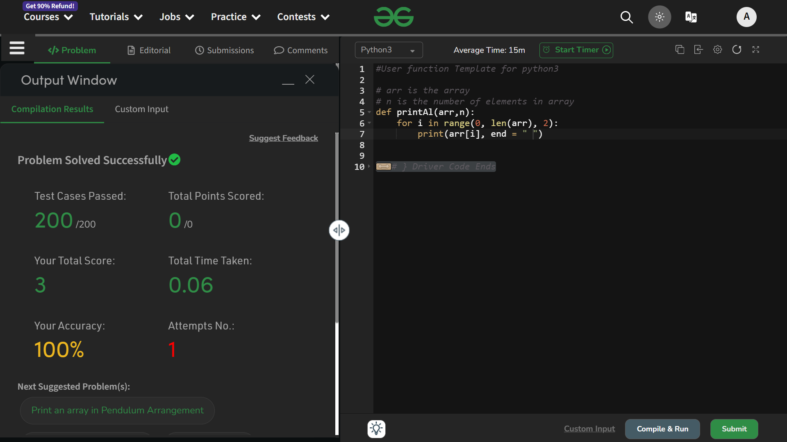

# Print alternate elements of an array

## Question
You are given an array A of size N. You need to print elements of A in alternate order (starting from index 0).

## Explaination
- It could be done in a number of ways, but here I have used `range()` function only to do this.

- we know that `range()` can take three argument at max, where the third argument denotes the *step-up-value* .
```python
range(<start> , <index> , <step-up>)
```

- Thats' why I provided a step-up of 2, which means that by default, it will iterate as - `0 , 2, 4, 6 ...`
```python
range(0, len(arr), 2)
```

Done ....

### Time Complexity : O(n)
### Space Complexity : O(1)

## Solution : Accepted 


# Thank You