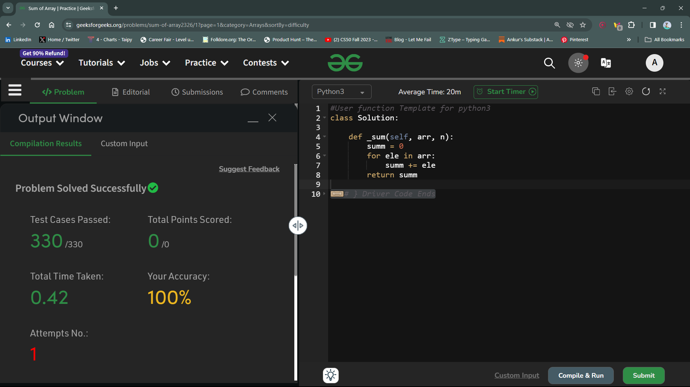

# Sum Of Array

## Question 
Given an integer array Arr[] of size N. The task is to find sum of it.

## Approach
- Python offers us a rich set of *Operators*, and one such set of operators is *Asignment Operators*.
- In python, we have normal item assignment using `=` operator or we can also assign values to a container (variable) using `addition assignment`. 
- Here I have made use of addition assignment `+=` operator.
Here's how ~
- In the first step, I declared a variable `summ` and assigned it a value 0, in order to avoid the garbage value problem.
```python
summ == 0
```
**_Especially_** I have used a `summ` with two *mm* to avoid the ambiuguity with the function's name, which is `_sum`

- In the second step, I used a for loop to iterate through the elements of the array one-by-one and add that value to the `sum` variable.
A point to be noted is that I have used `+=` addition assignment, rather than the normal assignment, in order to retain the previous value inside the sum variable. We can also do it in other way , `summ = summ + ele`

Thats' it.....

## Performance Status : Accepted


## Solution ScreenShot


# Thank You