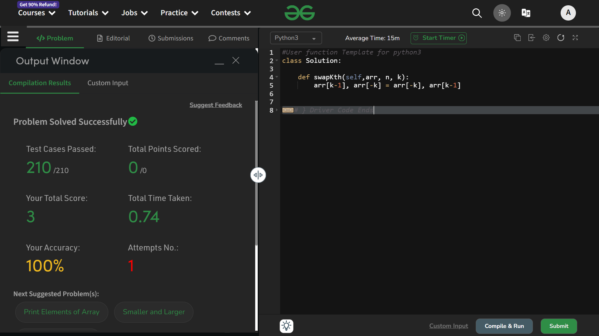

# Swap Kth Elements

## Question 
- Given an array Arr of size N, swap the Kth element from beginning with Kth element from end.
- Consider 1 based indexing

## Explaination
Simple --
```python
arr[k-1], arr[-k] = arr[-k], arr[k-1]
```

### Time Complexity : Expected & In real : O(1)
### Space Complexity : Expected & In real : O(1)

## Solution : Accepted


# Thank You