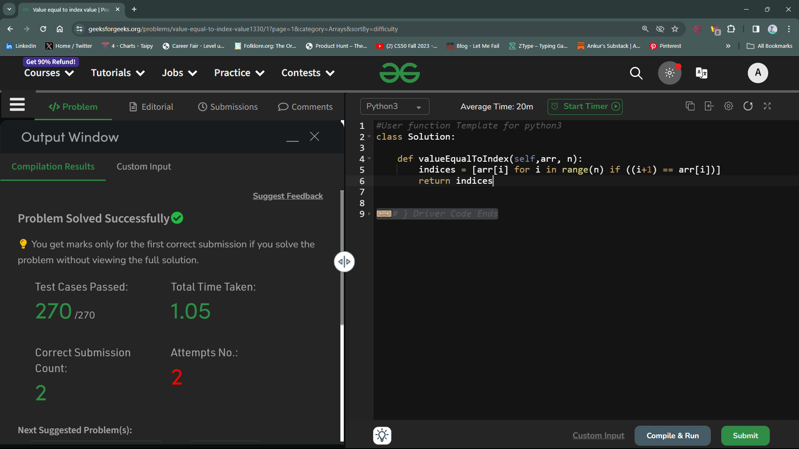

# Value equal to index value

## Question ~ 
Given an array Arr of N positive integers. Your task is to find the elements whose value is equal to that of its index value ( Consider 1-based indexing ).

You don't need to read input or print anything. Your task is to complete the function valueEqualToIndex() which takes the array of integers arr[] and n as parameters and returns an array of indices where the given conditions are satisfied. When there is no such element exists then return an empty array of length 0.

## Explaination
In this question, we are given an array (`arr[]`) and its length `n` . Our task is to find out all the elements inside this array which are exactly equal to their index value. And follow 1- based indexing. And return an array having all those indices.

lets' breakdown the question ~
- we have to find out all the elements which are equal to their index position. 
- And follow 1- based indexing.
    - assume an array as --> 
    ```python
    arr = [8, 2, 9, 6]
    ```
    - 1- based indexing means - 

    | array elements --> | 8 | 2 | 9 | 6
    | :-:| :-:| :-:| :-:| :-: |
    | index positions --> | 1 | 2 | 3 | 4 |

    - It is clear that element at position 2, is equal to its position, that is 2.

    - So, there will be an array, lets' say `indices = []` , which will have the this position as its element.

     ```python
    indices = [2]
    ```
- I hope the question is clear now.

Lets' move to the solution
- Python offers us *list comprehensions*, which really eases out our taskes by reducing the amount of lines we have to write to make the code working. And we'll use the same.
- **Step 1:** create a list with an identifier `indices` 
```python
indices = []
```
- Now we'll create a comprehension inside it as ~
```python
indices = [arr[i] for i in range(n) if ((i+1) == arr[i])]
```

- Lets' understand this comprehension :
 - a *for loop* is there which is iterating thorugh the length of the array. 
 - Now, *if the value at (index+1)<sup>th</sup> position is equal to the element at i<sup>th</sup> position, then append that element in the indices array.*

- **Step 2:** return the array using `return` keyword.
```python
return indices
```

Thats' it.....


## Performance Status : Accepted

## Value of complexities
Expected Value of time complexity : O(n)

Resulted Value of time complexity : O(n)

Expected Value of space complexity : O(1)

Resulted Value of space complexity : O(k)

## Solution


# Thank You