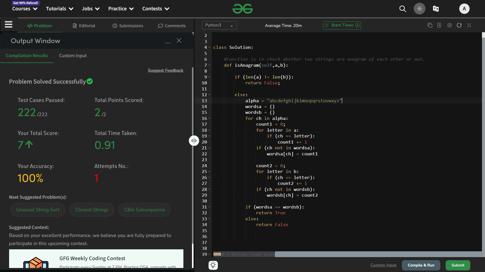

# Anagram

## Question
Given two strings a and b consisting of lowercase characters. 

The task is to check whether two given strings are an anagram of each other or not. 

An anagram of a string is another string that contains the same characters, only the order of characters can be different. For example, act and tac are an anagram of each other.

If the strings are anagrams you have to return True or else return False

## Explaination
- So as per the question, the first thing that I have ensured is that *the length of both the strings must be equal*, otherwise, don't do anything.

- If the lengths are equal, then there is a chance that both the strings are equal. To check that I have an algorithm in my mind.

- If both the strings are equal in length and has same occurences of all the characters, then they are anagrams. 
    - What we can do is that, we can count the occurence of each of both the strings and put them in the form of a {*key:value*} pair in two dictionaries, respectively. 
    - And then check the equality of those dictionaries! If they are, then they are anagram, otherwise not.

The same I have done......

# Status : Accepted

### Time Compelxity : O(n)
### Space Compelxity : O(1)

# Thank You