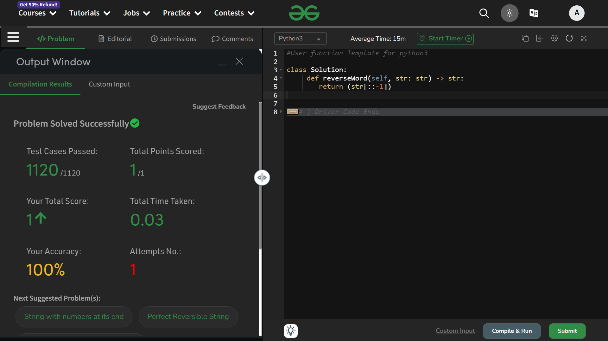

# Reverse A String

## Question ~
- You are given a string s. You need to reverse the string.

- You only need to complete the function reverseWord() that takes s as parameter and returns the reversed string.

## Approach
- We can use the string slicing to do this

- just write 
```python
return str[::-1]
```

## Explaination
```python
return str[::-1]
```
It is equivalent to 
```python
return str[<length-of-string>:0:-1]
```
Step-up of ***-1*** helps in traversing the string in reverse direction.

## Thats' it...

### Time Complexity : O(n) 
### Space Complexity : O(1) 

## Status : Accepted

## ScreenShot : 

# Thank You