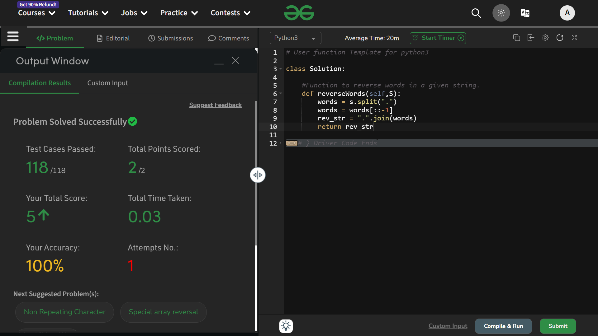

# Reverse words in a given string

## Question
Given a String S, reverse the string without reversing its individual words. Words are separated by dots.

You dont need to read input or print anything. Complete the function reverseWords() which takes string S as input parameter and returns a string containing the words in reversed order. Each word in the returning string should also be separated by '.' 

## Explaination
- In the first step. we'll create list out this string `S` . And for doing that, I will use the `split()` method in strings.

    - The `split()` method in python helps in breaking down a string from a specific piece, found anywhere in that string and make a list out of all the pieces formed from that starting.
    - By default, `split()` has " " *one unit white space* as its default value, we will change that to *"."* , because that's the only way of getting the words separated as a single entity.
    ```python
    words = s.split(".")
    ```

- Now we have a list or array `words` formed from the string `S` . To visualise, 
```python
S = "I.am.solving.this.question"
words = ["I", "am", "solving", "this", "question"]
```

- In the second step, we will reverse this list. Because according to the question, the words have to be the same, but their positions have to be reversed.
```python
words = words[::-1]
```

- Now the state of `words` is like this 
```python
words = ["question", "this", "solving", "am", "I"]
```

- In the third step, we will create a string out it by using the `join()` method.
```python
rev_str = ".".join(words)
```
This will ensure that every word is again separated by a *"."* .

- In the fourth step, we will return it.
```python
return rev_str
```

*That's it.*

### Expected Time Complexity: O(|S|)        In Real Time Complexity: O(|S|)
### Expected Auxiliary Space: O(|S|)        In Real Auxiliary Space: O(|S|)

## Solution : Accepted


# Thank You